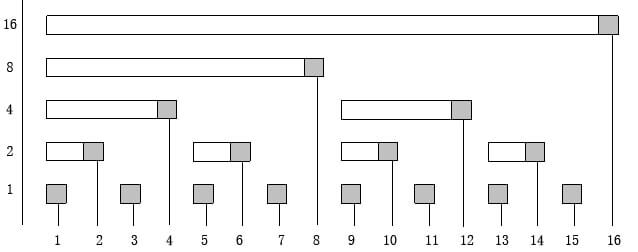

# BIT \(Binary Indexed Tree\)

### 什麼是 BIT 呢？

BIT \(Binary Index Tree\) 是一個在1994年，由 **Peter M. Fenwick** 所提出的一種資料結構，在國外也常直接叫這個資料結構 「**Fenwick Tree**」，而對岸會叫他「樹狀樹組」，他能夠很有效率的解決需要前綴操作的問題與詢問，並將其降至 $$O(\log n) $$ 

### 數字的lowbit?

在介紹 BIT 的原理與實作前，需要先知道一個數字的「**lowbit**」是什麼，因為他是這個資料結構的核心，而他的定義為「**數字轉成二進位後，最後一個 1 的數值**」。就只有這句話可能有點難懂，讓我們實際來看一下

**範例：**

1. $$5 = (101)_{binary} $$ ，那麼 $$lowbit(5) = (1)_{binary} = 1$$

2. $$10 = (1010)_{binary}$$ ，那麼 $$lowbit(10) = (10)_{binary} = 2$$ 

### 程式上要怎麼去找到數字的lowbit呢？

找lowbit的的結論很簡單，就是短短一行 $$x\&(-x)$$ ，至於這行是什麼意思呢

$$-x$$ 的位元運算，做的事情是將 NOT x + 1，也就是將 $$x$$ 的位元反轉後加上 $$1$$ 

**範例**：

 1. $$5 = (101)_{binary}$$ ，那麼 $$-5 = (010)_{binary} + 1 = (011)_{binary}$$ 

2. $$10 = (1010)_{binary}$$ ，那麼 $$-10 = (0101)_{binary} + 1 = (0110)_{binary}$$ 

而 $$\&$$ 就是位元運算 AND 的操作，由上面的舉例應該能很清楚的觀察到這是正確的

**範例：**

1. $$5\&(-5) = (101)_{binary} \& (011)_{binary} = (001)_{binary} = 1$$ 

2. $$10\&(-10)=(1010)_{binary} \& (0110)_{binary} = (0010)_{binary} = 2 $$ 

對於lowbit的操作，可以自己練習看看找數字的lowbit

### BIT的運作原理



這棵樹長的就像上圖，我們用一個陣列來表示所有節點，而可以每個節點儲存的是一段區間的總和，至於是哪一段區間呢？（以下用 $$BIT[i]$$ 表示為樹上的節點， $$Sum(l,r)$$ 表示為 $$[l,r]$$ 的和）


**BIT**節點儲存的資料為： $$BIT[i] = Sum(i-lowbit(i)+1,i)$$ 


### 前綴詢問 

而在詢問時，若要詢問到 $$i$$ 的前綴和，該怎麼做呢？

```cpp
int bit[MAXN]; //存BIT節點的陣列
int sum(int i){
    int res = 0;
    while(i){ //當i不等於零時，去找答案
        res += bit[i]; //更新答案
        i -= i&(-i); //減掉lowbit，繼續找答案
    }
    return res;
}
```

這樣就完成前綴詢問了！

時間複雜度呢？很明顯最多執行 $$log_2(i)$$ 次！因此詢問的複雜度是 $$O(\log n)$$ 

### 單點修改

那如果我們要進行單點修改呢？只要更新會用到這個點的區間不就好了！


\*\*\*\*

