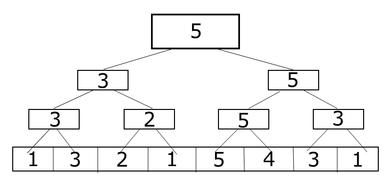
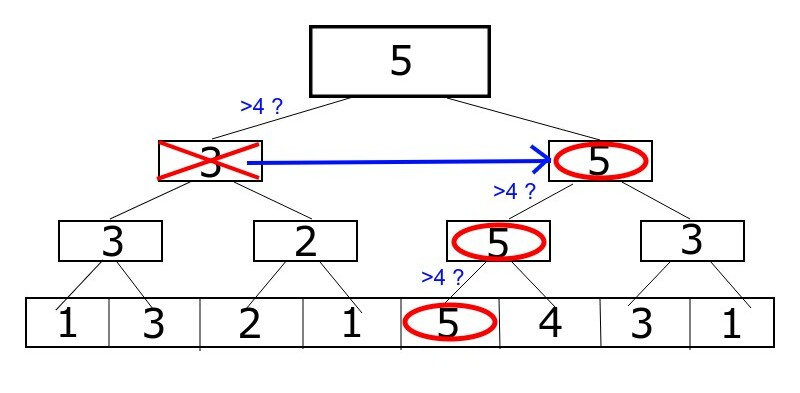

# 線段樹（二）

在前一個章節，我們學會了單點修改、區間詢問的線段樹



而現在呢？如果我們有一道問題如下

> 在一個陣列中尋找第一個出現的大於 $$x$$ 的位置，同時也會有修改元素的操作

這樣的問題，線段樹也辦得到！如果要尋找第一個數字，該怎麼做呢？

我們可以試著用一棵區間詢問最大值的線段樹來幫我們做到這一點



當我們建立完一棵區間最大值線段樹之後，我們可以在樹上去尋找我們要的位置，如下圖



這樣的動作一般稱為「線段樹上二分搜」，如同圖上，我們先從最上面那個點開始找

大致操作如下



```cpp
int find(int x, int idx, int l, int r){
    if(l==r) return l; //找到了就回傳
    int m = (l+r)/2;
    
    //往兩邊找，如果左邊的最大值>=x，往左繼續找
    //否則往右找
    if(tr[idx*2] >= x) return find(x, idx*2, l, m); 
    else return find(x, idx*2+1, m+1, r);
}
```



學會怎麼做之後，當然就是要來做練習題囉



[點我前往題目](https://codeforces.com/edu/course/2/lesson/4/3/practice)

B:  詢問為 $$0/1$$ 陣列中第 $$k$$ 個 $$1$$

C:  詢問第一個大於 $$x$$ 的元素的出現位置

D:  同上，但是詢問增加了位置需要在 $$l$$ 右邊的條件



```cpp
#include <bits/stdc++.h>

#define ll long long
#define fastio ios_base::sync_with_stdio(0); cin.tie(0); cout.tie(0);

using namespace std;

const int MAXN = 1e5+5;
ll tr[MAXN*4], arr[MAXN]; 

ll combine(ll a, ll b){
    return a+b;
}

void build(int idx, int l, int r){
    if(l==r){
        tr[idx] = arr[l]; 
    }else{
        int m = (l+r)/2;
        build(idx*2,l,m); 
        build(idx*2+1,m+1,r); 
        tr[idx] = combine(tr[idx*2],tr[idx*2+1]); 
    }
}

void update(int pos, int idx, int l, int r){
    if(l==r){
        tr[idx] ^= 1;
        return;
    }
    int m = (l+r)/2;
    if(pos <= m) update(pos, idx*2, l, m);
    else update(pos, idx*2+1, m+1, r);
    tr[idx] = combine(tr[idx*2],tr[idx*2+1]); 
}

ll query(int ql, int qr, int idx, int l, int r){
    if(ql <= l && r <= qr){
        return tr[idx];
    }
    int m = (l+r)/2;
    if(ql > m){
        return query(ql, qr, idx*2+1, m+1, r);
    }
    if(qr <= m){
        return query(ql, qr, idx*2, l, m);
    }
    return combine(query(ql, qr, idx*2, l, m), query(ql, qr, idx*2+1, m+1, r));
}

int find(int x, int idx, int l, int r){
    if(l==r) return l; 
    int m = (l+r)/2;
    
    if(tr[idx*2] >= x) return find(x, idx*2, l, m); 
    else return find(x-tr[idx*2], idx*2+1, m+1, r);
}

signed main(){
    fastio
    int n, m;
    cin >> n >> m;
    for(int i = 0; i < n; i++){
        cin >> arr[i];
    }
    build(1, 0, n-1);
    for(int i = 0;i < m;i++){
        int op;
        cin >> op;
        if(op==1){
            int i;
            cin >> i;
            update(i, 1, 0, n-1);
        }else{
            int k;
            cin >> k;
            k++;
            cout << find(k, 1, 0, n-1) << "\n";
        }
    }
}
```



```cpp
#include <bits/stdc++.h>

#define ll long long
#define fastio ios_base::sync_with_stdio(0); cin.tie(0); cout.tie(0);

using namespace std;

const int MAXN = 1e5+5;
ll tr[MAXN*4], arr[MAXN]; 

ll combine(ll a, ll b){
    return max(a,b);
}

void build(int idx, int l, int r){
    if(l==r){
        tr[idx] = arr[l]; 
    }else{
        int m = (l+r)/2;
        build(idx*2,l,m); 
        build(idx*2+1,m+1,r); 
        tr[idx] = combine(tr[idx*2],tr[idx*2+1]); 
    }
}

void update(int pos, int val, int idx, int l, int r){
    if(l==r){
        tr[idx] = val;
        return;
    }
    int m = (l+r)/2;
    if(pos <= m) update(pos, val, idx*2, l, m);
    else update(pos, val, idx*2+1, m+1, r);
    tr[idx] = combine(tr[idx*2],tr[idx*2+1]); 
}

ll query(int ql, int qr, int idx, int l, int r){
    if(ql <= l && r <= qr){
        return tr[idx];
    }
    int m = (l+r)/2;
    if(ql > m){
        return query(ql, qr, idx*2+1, m+1, r);
    }
    if(qr <= m){
        return query(ql, qr, idx*2, l, m);
    }
    return combine(query(ql, qr, idx*2, l, m), query(ql, qr, idx*2+1, m+1, r));
}

int find(int x, int idx, int l, int r){
    if(tr[idx] < x) return -1;
    if(l==r) return l; 
    int m = (l+r)/2;
    
    if(tr[idx*2] >= x) return find(x, idx*2, l, m); 
    else return find(x, idx*2+1, m+1, r);
}

signed main(){
    fastio
    int n, m;
    cin >> n >> m;
    for(int i = 0; i < n; i++){
        cin >> arr[i];
    }
    build(1, 0, n-1);
    for(int i = 0;i < m;i++){
        int op;
        cin >> op;
        if(op==1){
            int i, v;
            cin >> i >> v;
            update(i, v, 1, 0, n-1);
        }else{
            int x;
            cin >> x;
            cout << find(x, 1, 0, n-1) << "\n";
        }
    }
}
```



```cpp
#include <bits/stdc++.h>

#define ll long long
#define fastio ios_base::sync_with_stdio(0); cin.tie(0); cout.tie(0);

using namespace std;

const int MAXN = 1e5+5;
ll tr[MAXN*4], arr[MAXN]; 

ll combine(ll a, ll b){
    return max(a,b);
}

void build(int idx, int l, int r){
    if(l==r){
        tr[idx] = arr[l]; 
    }else{
        int m = (l+r)/2;
        build(idx*2,l,m); 
        build(idx*2+1,m+1,r); 
        tr[idx] = combine(tr[idx*2],tr[idx*2+1]); 
    }
}

void update(int pos, int val, int idx, int l, int r){
    if(l==r){
        tr[idx] = val;
        return;
    }
    int m = (l+r)/2;
    if(pos <= m) update(pos, val, idx*2, l, m);
    else update(pos, val, idx*2+1, m+1, r);
    tr[idx] = combine(tr[idx*2],tr[idx*2+1]); 
}

ll query(int ql, int qr, int idx, int l, int r){
    if(ql <= l && r <= qr){
        return tr[idx];
    }
    int m = (l+r)/2;
    if(ql > m){
        return query(ql, qr, idx*2+1, m+1, r);
    }
    if(qr <= m){
        return query(ql, qr, idx*2, l, m);
    }
    return combine(query(ql, qr, idx*2, l, m), query(ql, qr, idx*2+1, m+1, r));
}

int pos = 1e9;

void find(int ql, int x, int idx, int l, int r){
    if(tr[idx] < x) return;
    if(l==r){
        pos = l;
        return;
    }
    int m = (l+r)/2;
    
    if(tr[idx*2] >= x && m >= ql) find(ql, x, idx*2, l, m); 
    if(pos==1e9) find(ql, x, idx*2+1, m+1, r);
}

signed main(){
    fastio
    int n, m;
    cin >> n >> m;
    for(int i = 0; i < n; i++){
        cin >> arr[i];
    }
    build(1, 0, n-1);
    for(int i = 0;i < m;i++){
        int op;
        cin >> op;
        if(op==1){
            int i, v;
            cin >> i >> v;
            update(i, v, 1, 0, n-1);
        }else{
            int x, l;
            cin >> x >> l;
            pos = 1e9;
            find(l, x, 1, 0, n-1);
            cout << (pos == 1e9 ? -1 : pos) << "\n";
        }
    }
}
```



