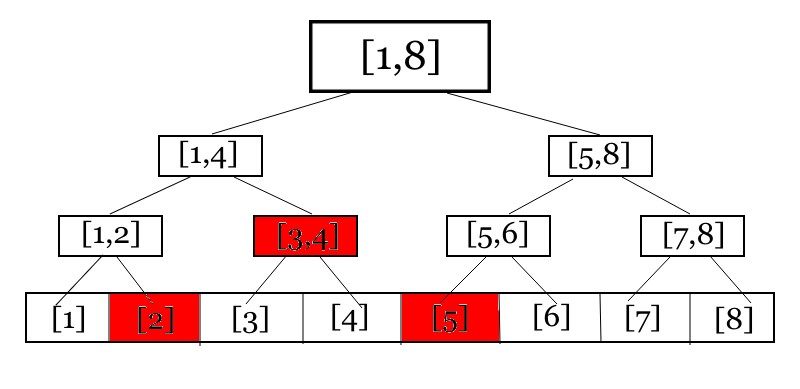

# 區間修改與懶惰標記

在看這章節前，若尚未學過單點修改的線段樹，請點選以下連結



### 區間修改 單點詢問

我們已經學過單點修改的線段樹可以在 $$O(\log n)$$的時間內完成，那麼如果我們今天只是要在修改後，詢問某一個位置的值，那麼我們其實可以使用一種技巧，也就是「差分」！

設一個陣列 $$A$$ 的元素為以下

$$
A[0], \ A[1], \ A[2], \ ..., \ A[n]
$$

在進行區間修改 $$[l,r]$$ 時，如果我們每一個點都去修改他的值，我們要花的時間為 $$O((r-l+1)\log n) \approx O(n \log n)$$ ，實在不是一個非常好的作法

如果我們用另外一個陣列 $$B$$ 存陣列 $$A$$ 兩兩元素之間的差距呢？ 也就是如下

$$
A[1] - A[0], \ A[2] - A[1], \ A[3] - A[2], ..., \ A[n] - A[n-1]
$$

那其實只需要讓 $$B[l]$$ 去加上區間所要加的值，以及 $$B[r+1]$$ 去減掉區間加的值

當我們在詢問 $$A[i]$$ 時，只要詢問陣列$$B$$ 的前 $$i$$ 項之和，即可得到答案

時間複雜度：區間加值 $$O(\log n)$$ ，單點求值 $$O(\log n)$$ 

### 區間修改 區間詢問

我們可以看一下線段樹的運作方式，如下圖

在我們要修改區間 $$[2,5]$$ 時，我們其實只要像區間詢問時，只修改上面塗成紅色的三個區間就好了

但是！這樣會出現一個問題，當我們修改完 $$[3,4]$$ 之後，如果詢問 $$[3]$$ 的值呢？會發現如果我們僅僅是修改 $$[3,4]$$ ，那麼在詢問 $$[3]$$ 的時候，就會是還沒修改過的值了

你可能會想，那我們就認命的一個一個元素慢慢修改吧！

不過！這一點，線段樹可以輕鬆解決！ 我們可以在每一個節點去紀錄已經修改過的值，當我們在詢問他的子節點時，再下推答案就好了！

這時候我們就會用到我們稱為「懶惰標記」的東西

