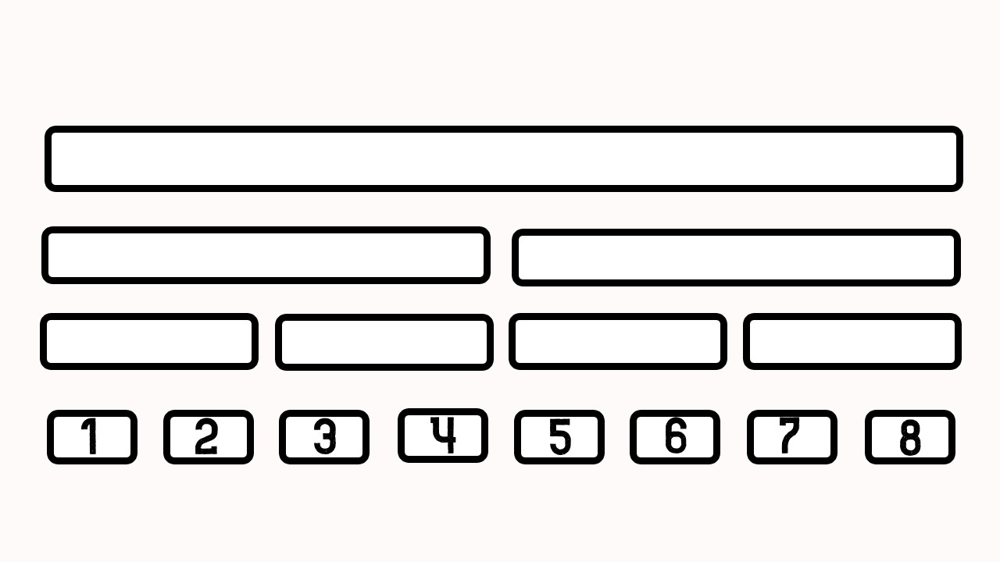
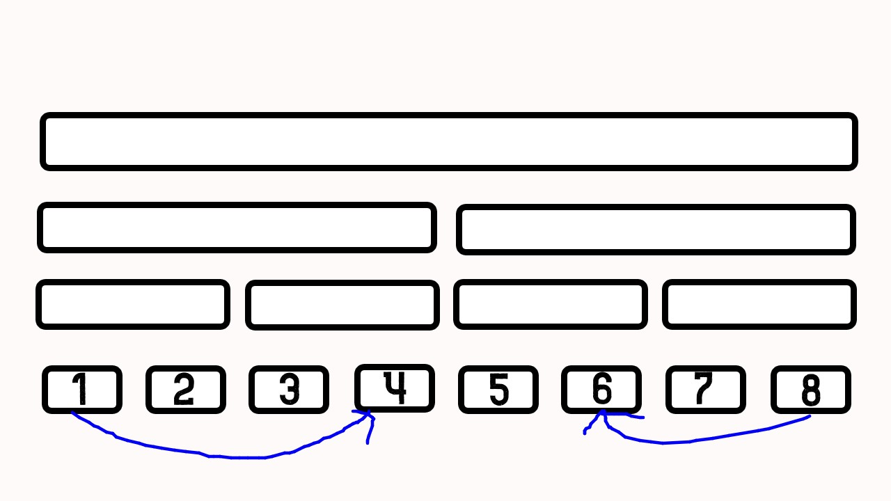

# 線段樹優化建圖

考慮[這個問題](https://codeforces.com/problemset/problem/786/B)（Codeforces 786B\)

> 給定一張 $$n$$ 個點的有向圖，接下來有以 $$q$$ 次加邊的操作
>
> 每次操作會是以下三種
>
> * $$1\ u \ v \ w$$ :從 $$u$$ 到 $$v$$ 建一條權重為 $$w$$ 的邊。
> * $$2\ u \ l \ r \ w$$ :從 $$u$$ 到 $$[l,r]$$ 區間內所有點建一條權重為 $$w$$ 的邊。
> * $$3\ v \ l \ r \ w$$ :從  $$[l,r]$$ 區間內所有點到 $$u$$ 建一條權重為 $$w$$ 的邊。
>
> 輸出從原點 $$s$$ 到所有點的最短路徑長
>
> * $$1 \le n, \ q  \le 10^5$$

這個問題，看起來非常困難，除了第一種操作以外，另外兩個操作除了對於每個點都建立一個邊以外，有其他方法嗎？

答案是有的！既然遇到與區間有關的問題，我們就可以嘗試線段樹！

我們可以開一棵線段樹，並將線段樹上的節點當成圖上的節點，如下圖

在第一種操作時，我們就正常的去連邊

第二種操作與第三種操作的話就比較特別了，我們連到代表所有區間的點

![&#x5F9E; 1 &#x9023;&#x908A;&#x5230; \[3,5\]](../../.gitbook/assets/segment-tree-graph-2-.jpg)

之後，將所有節點與其葉節點之間都分別建立一條雙向的邊！

我們就完成了線段樹的建圖了！

